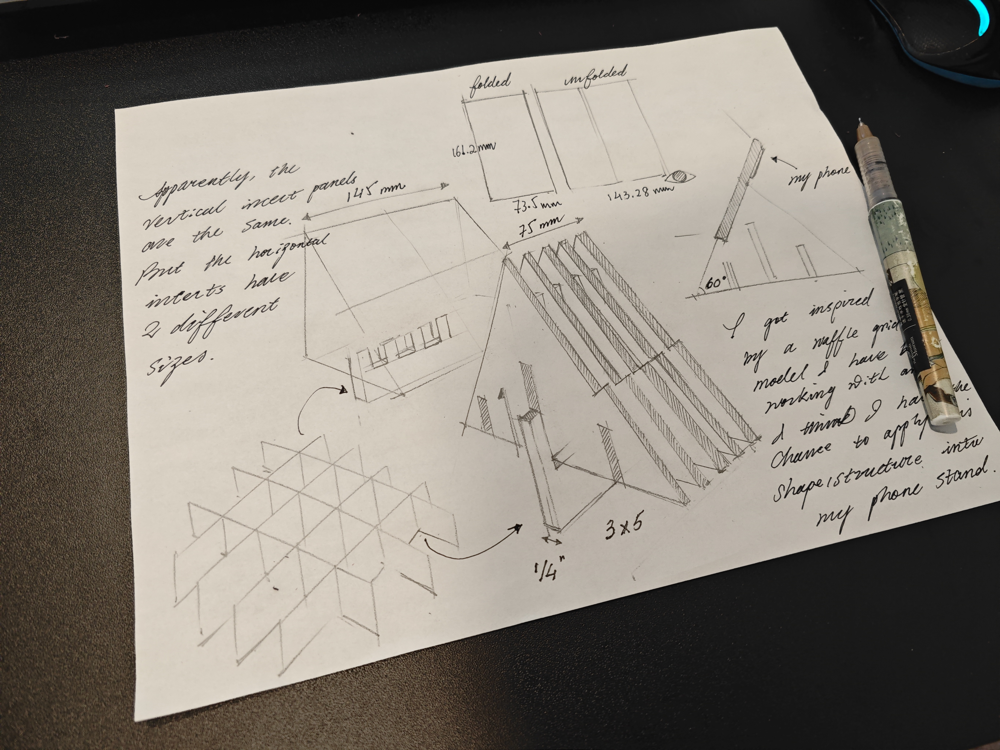

# Report 8 - Week of 10/18/2023

# Report 7 - Week of 10/11/2023

## Get our hands dirty! 

Now we have a amatuer idea and we should 

# Report 6 - Week of 10/04/2023

## Ideation and New Team! 

This week, luckily, I got my new team and we are friend with each other. We started ideation and finally zoomed into one interesting topic- free diving. I love marine environment that is why we choose the idea. Instead of designing something for user group that we are not familiar with, we want to focus on something we know and make possitive changes to their lives. 

## So, what is the problem? 

Free diving, has one of the highest death rates among other marine sports. There are 10000 free divers in the United States, and every year, 20 free divers who have lost their lives, which is 1/500 of the free diving community. BO, which stands for Black Out, is the No.1 cause of death for Free Divers. Among 400 cases of BO accidents, 75% of divers lost their lives. When you encounter a BO, your teammate must rescue you immediately, or it might lead to irreversible damage, or death. You cannot self-rescue.

## How to solve the problem? 

We have studied from Avalanche Backpacks, which is a backpack skiier use when they encounter a avalanche. The airbag inside the bag will be inflated and help the user to flow on the surface of the snow. Maybe we can study from it? 

# Report 5 - Week of 09/27/2023

## Testing out Photon 2 at Home

This week we did some simple demos, it wasn't difficult, but it was a lot of fun, I used phaton 2 to make a simple flashing light. Since I have some experience with arduino, so I had a lot of fun discussion this with my friends on class. I have also been to the MDes website to check out previous student works, they are amazing! and I wish to make something cool like them

## Team Topics
I also chose the theme of the future group, and I think it is challenging to carry out complex product functions through modules. I am looking forward to the future group cooperation!

# Report 4 - Week of 09/20/2023

## Setting Up Photon 2 at Home

I finally had a short break after the project 1. This week's work was very easy. I set up my Photon 2 at home. Thanks to my previous experience with Arduino, I didn't find this setup to be a challenge. Even though I am familiar with such setups, I still chose to follow some tutorials to make this project more enjoyable! I have not yet completed the final step, which involves connecting to the school's IOT network. However, I plan to finish this before the upcoming class.

## Reflecting on the Importance of IOT Skills

I believe that mastering IOT is essential for industrial designers. Leveraging these small components allows us to implement a wide range of product functionalities, even if they may not always be perfect or flexible.

# Report 3- Week of 09/14/2023

## Design Concept Completion

This week, I completed the design concept, which was presented by hand drawing.

## Modeling with Grasshopper and Rhino

I also completed modeling with Grasshopper and Rhino. Then, I used a laser cutter to cut out different panels on a large piece of acrylic board.

## Video Demonstration on YouTube

I also created a video demonstration and uploaded it on YouTube. The link is as followed: [Watch the Video](https://youtu.be/hNxhHeBuomM)

# Report 2 - Week of 09/07/2023 #

## Summary of the week

In the past one week (including an excited three-day weekend), I completed the 3D printing training online, and learned about Grasshopper tutorial by watching Youtube videos. This gave me a better understanding of Grasshopper, even though I still can't quite accept it as my main tool when designing. 

## Demonstration of the Ideal Phone Stand (My Rhino crashed when I tried to apply the grid texture onto its surface so I do not have a model yet)

Also this week, I sketched an ideal phone stand. I hope there is a phone stand that can support a foldable phone in two different folded states. I used Rhino to do some simple demonstrations.I'm a model enthusiast for warships, and I took inspiration from a photo-etched structure I recently assembled.

## Learning Challenges with Grasshopper

In the process of learning Grasshopper, I still have no way to fully understand the relationship between different batteries. At the current stage, Rhino and Fusion 360 are still my main tools for modeling.Maybe these tools are more useful for products without complex structures. However, I think what I learned in Grasshopper, such as the texture or grid of the surface of the object, will help me build more diverse products in the future.

# Report 1 - Week of 08/21/2023 #

## Learning State and Excitement about the Project

This week I gradually started to enter the state of learning. I was very excited when I heard that we can design a stand for a specific mobile phone, because I have a different mobile phone—Xiaomi Mix Fold 3.

### The Two States of Folding Phones

The folding screen mobile phone has two states, open and folded. I took measurements on my phone, which will help me in the later design. I predict that this mobile phone stand should be able to support two types of mobile phones at the same time.

### Market Trends

More and more folding screen mobile phones have appeared on the market. Perhaps this mobile phone stand will bring convenience to people.

## Laser Cutter Experience

At the same time, I also tried to use a laser cutter to cut the model of the mobile phone holder on the wooden board. It was not a perfect attempt, because the laser cutting machine did not completely cut the wood due to the adjustment of the parameters.

### Lessons Learned

So, I had to use a utility knife to remove and polish the wood, but I think it was a good lesson.

