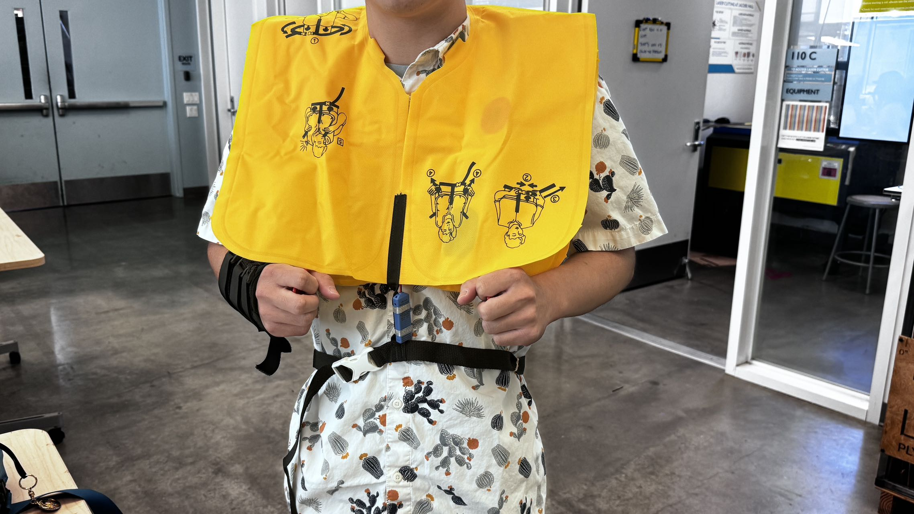

# Report 12- Week of 11/16/2023

## Large Language Model
This week we started our third project-Mini Me, by using ZeroWidth, a LLM build based on gpt 4.0 
I beleive it will be a new advanture for me. I am familiar with GPT but I am not really familiar with fine turning. So lets see

## Hand On Practices
I have started working on the model. Created my account on ZeroWidth and follow the instruction on the model. 

# Report 11- Week of 11/09/2023

## LLM Project Finished
This is a project based on ZeroWidth. By inputting some instructional information about me (Yang Cen), such as my designer’s weekly report and introduction of past works, others can ask some questions about my works through ZeroWidth. I think it is a very good platform based on gpt 4.0, which helped me get familiar with LLM training.

## Hand On Practices
I have started working on the model. Created my account on ZeroWidth and follow the instruction on the model. 

# Report 10- Week of 11/02/2023

## Large Language Model
This week we started our third project-Mini Me, by using ZeroWidth, a LLM build based on gpt 4.0 
I beleive it will be a new advanture for me. I am familiar with GPT but I am not really familiar with fine turning. So lets see

## Hand On Practices
I have started working on the model. Created my account on ZeroWidth and follow the instruction on the model. 

# Report 9- Week of 10/25/2023

## Previous projects
Now I have finished two projects so far. In my first project, it is a personal project, I used Grasshopper to design a phone stand for foldable phone users, which is also my first time using Grasshopper, excited but also complicated. Grasshopper enabled me to create designs and customize the stand to meet the requirements of different phone users. Then in the second project, it was an team effort, where we developed a life vest called "pufferfish” for free divers by utilizing the photon 2 platform. In both projects, I have experienced using some interesting tools and learned from them

## Speculation for the third project
As we transition to our third project involving AI applications, I'm eager to explore and integrate the various APIs I've previously encountered. I believe harnessing the power of AI can introduce innovative solutions and redefine the way we approach design challenges in the realm of emerging technologies.

# Report 8 - Week of 10/18/2023
Last week before the final presentation! All team members gathered together and we are filming and editing our presentation video, we want audience to have fun

## Final Product Test

Weilong and Yani debugged our product this week, thanks to their contribution. It is a product ready to go. The monitor will sense the heart rate of the diver, once he/she has a heart rate 20 times per min below his/her average heart rate. The device will vibrate and notify the diver. If the diver does not make a response within 5 seconds, which means that the diver might encountered a BO-Blackout, the life vest will be inflated and bring the diver back to the water surface. I think the idea of giving notification through vibration is a good idea, cause it can reduce the chance of error warning.

## Video Editing

Product video is always a lot of fun. Started with filming process, I wear the life vest and inflated it! It will definately bring my head to the surface of the water because it is really tight and almost chocked me. And more importantly it is one time use, yes! 90 dollar for just single use! That is why I said it is a really expensive project. Carina and I edit the video and combine different clips together. 

## My Contribute to the team and self-reflection
During the ideation phase, I believe my deep understanding of marine dynamics offered a lot of help in shaping the theme of our pufferfish rescuer project, especially in researching the challenges that free divers are facing and what similar product designers have created on the market. Although I am unfamiliar with the Photon microcontroller, I collaborated with my talented teammates, successfully integrating my marine expertise with their technical skills to enhance the functionality and responsiveness of our pufferfish rescuer. Last but not least, I took the responsibility of the video editing and shooting processes.
During the ideation phase, I believe my deep understanding of marine dynamics offered a lot of help in shaping the theme of our pufferfish rescuer project, especially in researching the challenges that free divers are facing and what similar product designers have created on the market. Although I am unfamiliar with the Photon microcontroller, I collaborated with my talented teammates, successfully integrating my marine expertise with their technical skills to enhance the functionality and responsiveness of our pufferfish rescuer. Last but not least, I took the responsibility of the video editing and shooting processes.

## Speculations 
### Human Experience 
The introduction of our pufferfish rescue vest will bring revolution to the diving community, because we switches free diving from an exciting yet risky “adventure”, into a absolutely save exploration of the underwater world. It's not just a rescue vest, but a safety promise to both beginners and advanced free divers. Now they can push their limits and explore deeper waters, because they know the fact- water will no longer take free divers’ lives. Pufferfish rescuer encourages those who were previously deterred by risks, who were scared of danger and potential accidents, to join free diving. This potentially leading to the expansion of free diving community, bring benefits to training schools and enthusiastic dive groups (more people to join). For family and friends who are worried on the shore, Pufferfish brings peace of mind alleviating their anxieties while waiting for the diver to resurface. While diving immerses you in nature’s rhythm, our amazing pufferfish rescuer ensures that the dance in the water continues!
### Mechanical Engineering 
The invention of our pufferfish rescuer means the coming of a new era in marine sports engineering advancements. A primary challenge is developing a heart rate monitor that's accurate under marine-environment. It should prevent false inflations while detecting heart rate anomalies. That is why we have the vibration warning system on pufferfish, you will have 5 seconds to react before false inflations. And the inflation mechanism, is well-known as one of the safest mechanism on the earth, since people are using that on the airplane. The material must be durable, yet flexible, to handle underwater pressures and ensure diver mobility. Ergonomic, a word that has been broadly discussed for free divers. Our pufferfish rescuer should be user-centered, which mean that it should accommodate various diver sizes and potentially customized requirements based on conditions or user needs. As the vest gains popularity and diving evolves, engineers must continually enhance its design to maintain safety standards.
### AI Tech
We believe machine learning can bring great contribution into the system of Pufferfish, it would enhance its safety features. By utilizing real time data analysis, like how an Apple Watch works, Pufferfish could proactively identify issues by comparing a divers vital signs with a huge amount of diving related data. This data would be stored offline and could potentially detect blackouts. The machine learning model would continuously learn from each dive gaining insights into user patterns and minimizing mistakes. If we also incorporated sensors that measure depth, pressure and temperature (I've actually experimented with this in one of my projects although it wasn't as accurate as the one) the AI system would provide a comprehensive overview of a divers physical condition. In case of emergencies the Pufferfish system could send real time distress signals along, with data to aid in rescues (including GPS information). After each dive Puffer AI would review your diving data, and provide analysis and updates. Pufferfish is a diving mentor enriching your diving experience.

# Report 7 - Week of 10/11/2023

## Connecting 2 photons

We had trouble connecting 2 photon devices, so we asked someone for help, and it eventually works. In case of our project, I think it will be easier to use ardduino since it does not really need to connect with the internet. 

## Get our hands dirty! 

Now we have a developed idea and we should move forward to design. The idea is to have a photo-centered system connected with an inflatable life vest. When the heartbeat monitor detects the diver's heartbeat is 20 times per minute below average, it will send a notification to the diver. If the diver does not turn off the notification in 5 seconds, the life vest will be inflated. Eventually, help the diver to resurface. 

## Selecting inflatable life vest on the market

We have found some well developed inflatable life vest on amazon, they are expensive but we got them! 

## We have also met some problem

The monitor we bought can only accept 5v but the export voltage of a photon 2 is only 2.2v, Weilong is really helpful and he solved the problem.  

# Report 6 - Week of 10/04/2023

## Ideation and New Team! 

This week, luckily, I got my new team and we are friend with each other. We started ideation and finally zoomed into one interesting topic- free diving. I love marine environment that is why we choose the idea. Instead of designing something for user group that we are not familiar with, we want to focus on something we know and make possitive changes to their lives. 

## So, what is the problem? 

Free diving, has one of the highest death rates among other marine sports. There are 10000 free divers in the United States, and every year, 20 free divers who have lost their lives, which is 1/500 of the free diving community. BO, which stands for Black Out, is the No.1 cause of death for Free Divers. Among 400 cases of BO accidents, 75% of divers lost their lives. When you encounter a BO, your teammate must rescue you immediately, or it might lead to irreversible damage, or death. You cannot self-rescue.

## How to solve the problem? 

We have studied from Avalanche Backpacks, which is a backpack skiier use when they encounter a avalanche. The airbag inside the bag will be inflated and help the user to flow on the surface of the snow. Maybe we can study from it? 

# Report 5 - Week of 09/27/2023

## Testing out Photon 2 at Home

This week we did some simple demos, it wasn't difficult, but it was a lot of fun, I used phaton 2 to make a simple flashing light. Since I have some experience with arduino, so I had a lot of fun discussion this with my friends on class. I have also been to the MDes website to check out previous student works, they are amazing! and I wish to make something cool like them

## Team Topics
I also chose the theme of the future group, and I think it is challenging to carry out complex product functions through modules. I am looking forward to the future group cooperation!

# Report 4 - Week of 09/20/2023

## Setting Up Photon 2 at Home

I finally had a short break after the project 1. This week's work was very easy. I set up my Photon 2 at home. Thanks to my previous experience with Arduino, I didn't find this setup to be a challenge. Even though I am familiar with such setups, I still chose to follow some tutorials to make this project more enjoyable! I have not yet completed the final step, which involves connecting to the school's IOT network. However, I plan to finish this before the upcoming class.

## Reflecting on the Importance of IOT Skills

I believe that mastering IOT is essential for industrial designers. Leveraging these small components allows us to implement a wide range of product functionalities, even if they may not always be perfect or flexible.

# Report 3- Week of 09/14/2023

## Design Concept Completion

This week, I completed the design concept, which was presented by hand drawing.

## Modeling with Grasshopper and Rhino

I also completed modeling with Grasshopper and Rhino. Then, I used a laser cutter to cut out different panels on a large piece of acrylic board.

## Video Demonstration on YouTube

I also created a video demonstration and uploaded it on YouTube. The link is as followed: [Watch the Video](https://youtu.be/hNxhHeBuomM)

# Report 2 - Week of 09/07/2023 #

## Summary of the week

In the past one week (including an excited three-day weekend), I completed the 3D printing training online, and learned about Grasshopper tutorial by watching Youtube videos. This gave me a better understanding of Grasshopper, even though I still can't quite accept it as my main tool when designing. 

## Demonstration of the Ideal Phone Stand (My Rhino crashed when I tried to apply the grid texture onto its surface so I do not have a model yet)

Also this week, I sketched an ideal phone stand. I hope there is a phone stand that can support a foldable phone in two different folded states. I used Rhino to do some simple demonstrations.I'm a model enthusiast for warships, and I took inspiration from a photo-etched structure I recently assembled.

## Learning Challenges with Grasshopper

In the process of learning Grasshopper, I still have no way to fully understand the relationship between different batteries. At the current stage, Rhino and Fusion 360 are still my main tools for modeling.Maybe these tools are more useful for products without complex structures. However, I think what I learned in Grasshopper, such as the texture or grid of the surface of the object, will help me build more diverse products in the future.

# Report 1 - Week of 08/21/2023 #

## Learning State and Excitement about the Project

This week I gradually started to enter the state of learning. I was very excited when I heard that we can design a stand for a specific mobile phone, because I have a different mobile phone—Xiaomi Mix Fold 3.

### The Two States of Folding Phones

The folding screen mobile phone has two states, open and folded. I took measurements on my phone, which will help me in the later design. I predict that this mobile phone stand should be able to support two types of mobile phones at the same time.

### Market Trends

More and more folding screen mobile phones have appeared on the market. Perhaps this mobile phone stand will bring convenience to people.

## Laser Cutter Experience

At the same time, I also tried to use a laser cutter to cut the model of the mobile phone holder on the wooden board. It was not a perfect attempt, because the laser cutting machine did not completely cut the wood due to the adjustment of the parameters.

### Lessons Learned

So, I had to use a utility knife to remove and polish the wood, but I think it was a good lesson.

